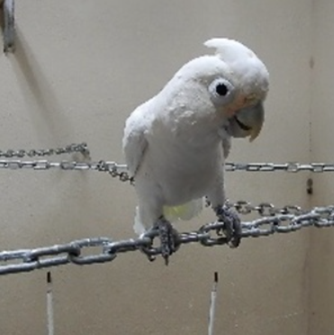
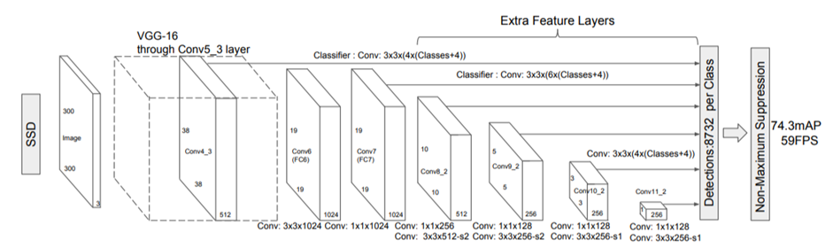
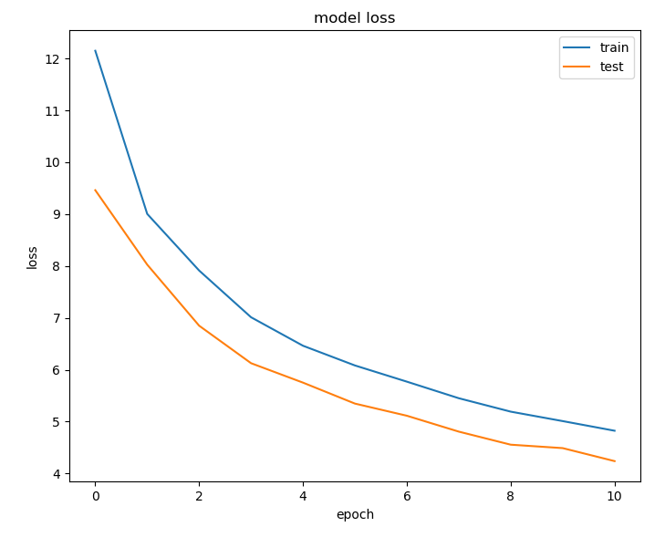
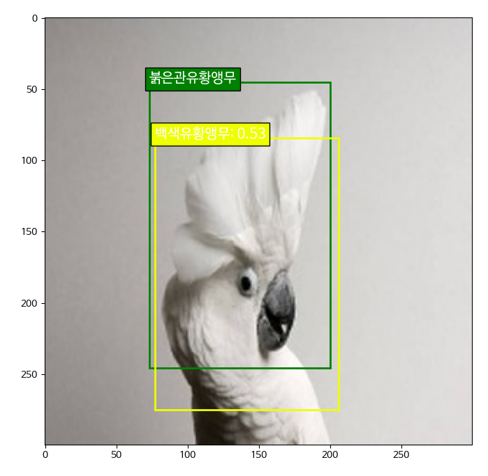
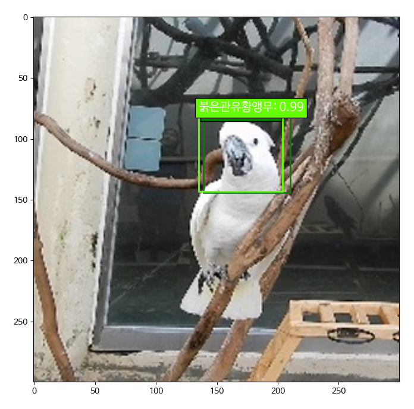
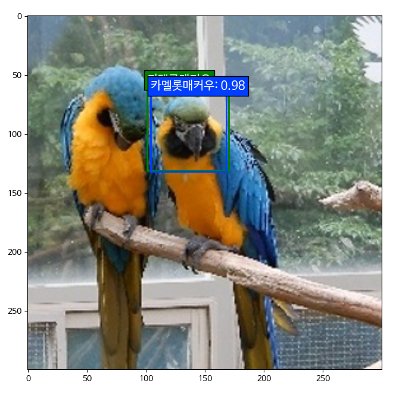

# 🦜 Object Detection 🦜

> Object detection 모델을 이용한 객체 탐지 모델 만들기
>
> SSD(Single Shot Multibox Detector) 사용


- 참고 Github: https://github.com/pierluigiferrari/ssd_keras
- 이용 모듈
  - python = 3.6
  - tensorflow = 1.14.0
  - keras = 2.2.4

---

### 1. 데이터 수집

- 11종의 앵무새 데이터(csv, img)

  - 11종: 고핀, 듀컵, 백색유황앵무, 붉은관유황앵무, 큰유황앵무, 스칼렛매커우, 청금강앵무, 카멜롯매커우, 홍금강앵무, 오색앵무, 회색앵무
  - 각 앵무새 종 폴더에 csv, img 폴더로 구성되어 있음

- img

  - 300x300 이미지

  


- csv

| frame             | xmin | xmax | ymin | ymax | class_id |
| ----------------- | ---- | ---- | ---- | ---- | -------- |
| 0001_00000080.jpg | 22   | 89   | 64   | 152  | 1        |
| 0001_00000047.jpg | 40   | 124  | 46   | 160  | 1        |
| 0001_00000121.jpg | 170  | 242  | 70   | 159  | 1        |

- **frame**: image file name

- **xmin, xmax, ymin, ymax**: 앵무새 머리 이미지의 Anchor Box pixel 위치값

- **class_id**: 앵무새 종 

  

---

### 2. 학습 데이터 전처리

- csv, img 파일을 train, test, val로 분리 

  ```python
  for filename in glob.iglob('모듈8데이터(SSD_앵무새)/**/*.csv', recursive=True):
      csv = pd.read_csv(filename)
      if 'train' in filename:
          train_csv = train_csv.append(csv)
          for img in glob.iglob('모듈8데이터(SSD_앵무새)/**/*.jpg', recursive=True):
              if img.split("\\")[-1] in csv['frame'].values:
                  shutil.copy(img, "모듈8데이터(SSD_앵무새)/train/")
      if 'test' in filename:
          test_csv = test_csv.append(csv)
          for img in glob.iglob('모듈8데이터(SSD_앵무새)/**/*.jpg', recursive=True):
              if img.split("\\")[-1] in csv['frame'].values:
                  shutil.copy(img, "모듈8데이터(SSD_앵무새)/test/")
      if 'val' in filename:
          val_csv = val_csv.append(csv)
          for img in glob.iglob('모듈8데이터(SSD_앵무새)/**/*.jpg', recursive=True):
              if img.split("\\")[-1] in csv['frame'].values:
                  shutil.copy(img, "모듈8데이터(SSD_앵무새)/val/")
  ```

- h5 file 생성(test, val도 동일하게 진행)

  ```python
  # 1: DataGenerator
  train_dataset = DataGenerator(load_images_into_memory=False, hdf5_dataset_path=None)
  
  # 2: Parse the image and label lists
  train_dataset.parse_csv(images_dir='data/train/',
                          labels_filename='data/train/train.csv',
                          input_format=['image_name', 'xmin', 'xmax', 'ymin', 'ymax', 'class_id'],
                          include_classes='all')
  
  train_dataset.create_hdf5_dataset(file_path='saved_model/dataset_train.h5',
                                    resize=False,
                                    variable_image_size=True,
                                    verbose=True)
  ```

  

---

### 3. 모델 선정 및 학습

- build model

  - **model**: ssd 300

    

  - **optimizer**: Adam

  ```python
  K.clear_session()  # Clear previous models from memory.
  
  model = ssd_300(image_size=(img_height, img_width, img_channels),
                  n_classes=n_classes,
                  mode='training',
                  l2_regularization=0.0005,
                  scales=scales,
                  aspect_ratios_per_layer=aspect_ratios,
                  two_boxes_for_ar1=two_boxes_for_ar1,
                  steps=steps,
                  offsets=offsets,
                  clip_boxes=clip_boxes,
                  variances=variances,
                  normalize_coords=normalize_coords,
                  subtract_mean=mean_color,
                  swap_channels=swap_channels)
  
  weights_path = './saved_model/VGG_ILSVRC_16_layers_fc_reduced.h5'
  model.load_weights(weights_path, by_name=True)
  
  adam = Adam(lr=0.0001, beta_1=0.9, beta_2=0.999, epsilon=1e-08, decay=0.0)
  ssd_loss = SSDLoss(neg_pos_ratio=3, alpha=1.0)
  
  model.compile(optimizer=adam, loss=ssd_loss.compute_loss)
  ```

- training

  ```python
  initial_epoch = 0
  final_epoch = 40
  steps_per_epoch = 100
  
  history = model.fit_generator(generator=train_generator,
                                steps_per_epoch=steps_per_epoch,
                                epochs=final_epoch,
                                callbacks=callbacks,
                                validation_data=val_generator,
                                validation_steps=ceil(val_dataset_size/batch_size),
                                initial_epoch=initial_epoch)
  ```


---

### 4. 모델 개선

- optimizer: sgd -> adam

- learning rate: 0.001 -> 0.0001

- steps_per_epoch: 10 -> 100

- batch_size, epoch


---

### 5. 모델 평가

epoch = 10까지의 결과 그래프 




loss값이 수렴하고 있음을 알 수 있다.


---

### 6. 테스트 결과

- epoch =  3, loss = 7.912, val_loss = 6.8487



붉은관유황앵무를 백색유황앵무로 예측하는 것을 보아, 제대로 예측을 하지 못하고 있음을 알 수 있다.


- epoch = 11, loss = 4.8239, val_loss = 4.2383







붉은관유황앵무를 붉은관유황앵무로, 카멜롯매커우를 카멜롯매커우로 분류하고 있는 것을 보아 예측 성능이 향상된 것을 알 수 있다.

